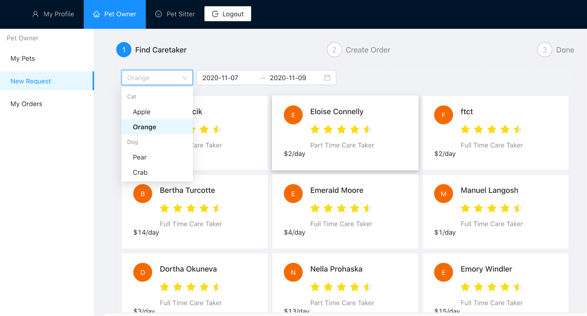
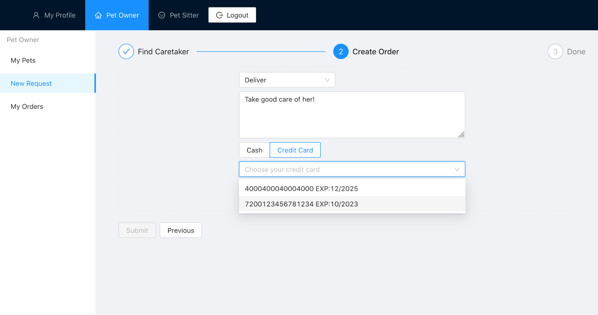
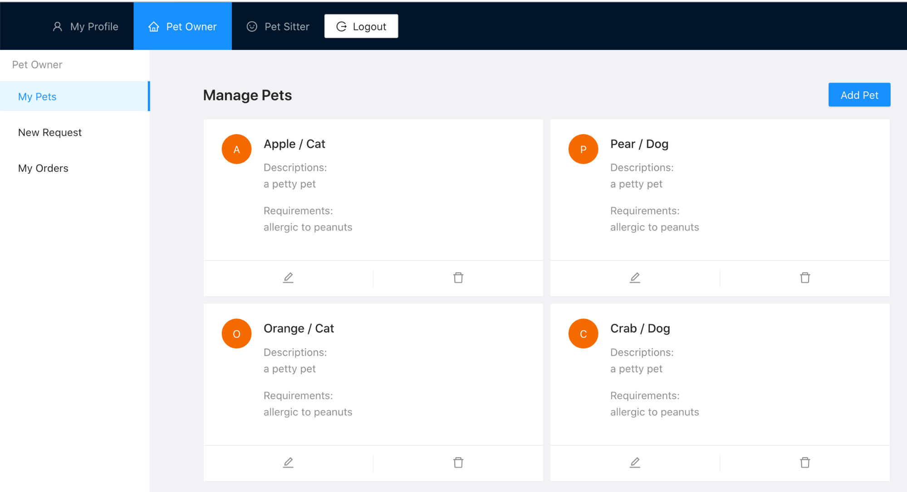

---
title: Pet Pets - CS2102 Project Team 75
author:
    - Branson Ng Khin Swee (A0182500U)
    - Chen Jiehan (A0187942N)
    - Ding YuChen (A0183866M)
    - Liu Xiaoyu (A0188952L)
    - Song Tianyi (A0187199H)
date: 7 Nov, 2020
geometry: "left=3cm,right=3cm,top=2cm,bottom=2cm"
# output: pdf_document
titlepage: true
footer-left: CS2102 AY20/21 Sem 1
table-use-row-colors: true
---

# Team

| Team member | Roles and responsibilities |
| -------------------- + ----------------------------------------------------------------|
| Branson Ng Khin Swee | Backend + DB for CareTaker, Schedules, Pets, Payments Did some triggers for Bids |
| Chen Jiehan | Frontend for Past Orders, CareTaker Profile |
| Ding YuChen | Frontend layout, features pertaining to Admin, authentication in the frontend, Care Taker pages |
| Liu Xiaoyu | Backend: CreditCard + Bid |
| Song Tianyi | Backend: user login + authentication; Frontend: My Pets + New Request page; All things DevOps (overall architecture, containerization, CI/CD) |

# Application Functionalities

Our application supports the below functions for their corresponding user type:

* All Users 
  - Register as Pet Owners or Caretakers (either Full-time or Part-time)
  - Login and sign up
  - Update profile and opt in as a caretaker

* PCS Administrators
  - Access to Summary statistics
  - View, create and update Pet Categories
  - Delete a Pet Category if there are no pets in that category
  - Set the base daily price for any pet category
  - View monthly payroll (salary of the caretakers)

* Pet Owners
  - Update Pet details
  - Add a new Pet
  - Bid for a caretaker for for a specific pet and declare transport method and payment method

* All CareTakers
  - View payment by month and year
  - View all pets taken care of (past and present)
  - View Feedback of past pets taken care of and ratings
  - View average rating
  - Declare daily price
  - Declare categories of pets he/she can take care of 
  - Care Takers declare their availability using a start date and an end date.

* Full Time Care Taker
  - Full-time Care Takers declare their leaves. Any time a Full-time Care Taker is not on leave, he is available
  - Can only accept bid request

* Part Time Care Taker
  - Part-time Care Takers declare their availability. A Part-time Care Taker is available if the request period of service is within one of his declared available periods.
  - Able to accept or reject bid request


# Data Constraints

## User:

1. Users cannot register for an account if their email already exists in the database
2. Users have a role that must be `admin` or `user`

## Pet:

1. A Pet can only be registered if it belongs to one of the pet categories created by the PCS administrator
2. Must belong to a user

## Care Takers:

1. Must reference a user account
1. A Care Taker’s rating is a floating point number between 1 and 5 that is the average of all the ratings that he/she has received

## Credit Cards:

1. Must reference a user account

## Bids:

1. Bids have a status of {`submitted`, `confirmed`, `reviewed`, `closed`}
   1. The necessity of `submitted` is due to the option for Part Timers to reject the bid
1. A Bid’s transport method is either `delivery`, `pickup`, `pcs`
1. End date cannot be before start date
1. Start date cannot be before the date the bid is created.
1. Must reference a Care Taker and a pet that belongs to the pet owner in the bid
1. The rating of a Bid is an integer of no less than 1 and no more than 5
1. Bids cannot be placed for the same pet with the same starting time
1. A bid is paid by either cash or credit card, but not both or neither.


## Schedules:

1. Care Taker schedules (leaves or availability entries) can only be declared in the current year and the next.
2. End date cannot be before start date
3. Must reference a Care Taker

# Trigger Constraints

## Care Takers

1. A non-overlapping constraint of Part Timers and Full Timers is placed over Care Takers (i.e., Care Takers can either be Part-time or Full-time but not both)

## Bids

1. A Bid cannot be updated if it is `closed`
1. Pet owners can only make a bid request for a CareTaker during a time period if Caretaker is not taking care of more than n pets during any time in that period
   1. Limit n is set at 5 for full time CareTakers 
   2. Limit n is 2 for part timers unless their average rating is > 4 then it is 5
1. Bid placement criteria
   1. All bids for Full Timers will only placed if the pet limit is not reached (as in 1) and the Full Timer is not on leave
   2. All bids for Full Timers will only be placed if the pet limit is not reached (as in 1) and the Part Timer is available
1. Pet owners can only make 1 bid request for each pet in the same time period (2 time periods are the same if they have the same start and end dates)
   1. This is with the exception of the case where bids have the same start and end dates and are all made for Part Time Care Takers
   2. I.e. when the pet owner has bidded the same period for multiple Part Time Care Takers for one pet
1. Constraint 4 also leads us to the fact that if any one of Part Time Care Takers set the bid status to ‘confirmed’ or the pet owner places a bid for the same period for a full timer, the bid status for the the other Part Timers will be set to ‘closed’

## Schedules

1. Care Taker must work for two 150 consecutive day periods per year (inclusive of weekends)
2. Constraints with bid
   1. A Full Timer may not apply for leave if a bid has already been made that has overlapped (inclusive of start and end dates)
3. Schedules for any user cannot overlap (inclusive of start and end dates)

# Non-trivial Aspects of Implementation

## Seeding the database

In order to generate realistic data that also fit into the application constraints, random data needs to be generated procedurally. This is done using the node module “faker”, that provides realistic data such as names and email, while also being deterministic once supplied a seed.

For each randomly generated user, 

* Randomly generate 0 - 5 pets from a randomly chosen pet category
  * Randomly generate 3 pets 
* Randomly decide whether the user is a part-time or full-time caretaker
  * Randomly generate 0 - 3 pet categories that the caretaker specializes in

## Tackling 60 Pet days in SQL for Full Timer monthly payments

To keep the implementation true to the specifications and given the way we stored our data as periods instead of individual dates, we had to find a way to convert these periods into dates so that we could coin the first 60 pet days of every month and pay Full Timers accordingly.

-   We overcame this by using the `generate_series` function which essentially works as a range generator with parameters start date, end date and interval.
-   After generating the dates, we then had to partition the query results from bids according to month and year and using a `row_number` over each partition so sorted by date and price so that we could get the first 60 pet days and their respective prices
-   With the `row_number`, we could then select the 61st and beyond pet days and include only those days in our calculation of the bonus

# ER Model

{ width=95% }

# Relational Schema

```sql
CREATE TABLE person(
   email varchar(64) PRIMARY KEY,
   fullname varchar(64) NOT NULL,
   password varchar(64) NOT NULL,
   address varchar(64) NOT NULL,
   phone int NOT NULL,
   role user_role NOT NULL,
   avatar_link varchar
);
```

| # | Value |
| ------------ + -------------------------------------------------------------- |
| FDs | {email $\rightarrow$ fullname, password, address, phone, role, avatar_link} |
| Normal Forms | BCNF, 3NF |

```sql
CREATE TABLE pet_category(
   type_name varchar(64) PRIMARY KEY,
   base_daily_price int NOT NULL
);
```

| # | Value |
| ------------ + ------------------------------------------------------ |
| FDs | {type_name $\rightarrow$ base_daily_price} |
| Normal Forms | BCNF, 3NF |

```sql
CREATE TABLE pet(
   name varchar(64),
   owner varchar(64) REFERENCES person(email),
   category varchar(64) REFERENCES pet_category(type_name) ON UPDATE CASCADE,
   requirements text,
   description text,
   CONSTRAINT pet_id PRIMARY KEY (name, owner)
);
```

| # | Value |
| ------------ + ------------------------------------------------------ |
| FDs | {name, owner $\rightarrow$ category, requirements, description} |
| Normal Forms | BCNF, 3NF |

```sql
CREATE TABLE credit_card(
   card_number bigint,
   cardholder varchar(64) REFERENCES person(email),
   expiry_date Date,
   security_code smallint,
   CONSTRAINT credit_card_id PRIMARY KEY (card_number, cardholder)
);
```

| # | Value |
| ------------ + ------------------------------------------------------ |
| FDs | {card_number, cardholder $\rightarrow$ expiry_date, security_code } |
| Normal Forms | BCNF, 3NF |

```sql
CREATE TABLE part_time_ct (
   email varchar(64) PRIMARY KEY REFERENCES person(email) ON DELETE CASCADE
);
```

| # | Value |
| ------------ + ------------------------------------------------------ |
| FDs | { } |
| Normal Forms | BCNF, 3NF |

```sql
CREATE TABLE full_time_ct (
   email varchar(64) PRIMARY KEY REFERENCES person(email) ON DELETE CASCADE
);
```

| # | Value |
| ------------ + ------------------------------------------------------ |
| FDs | { } |
| Normal Forms | BCNF, 3NF |

```sql
CREATE VIEW caretaker (email, caretaker_status, rating) AS (
   SELECT email, 1, 4.1 FROM  part_time_ct
   UNION
   SELECT email, 2, 4.2 FROM full_time_ct
);
```

```sql
CREATE TABLE pt_specializes_in (
   email varchar(64) REFERENCES part_time_ct(email) ON DELETE CASCADE,
   type_name varchar(64) REFERENCES pet_category(type_name) ON DELETE CASCADE ON UPDATE CASCADE,
   ct_price_daily int NOT NULL,
   CONSTRAINT pt_specializes_in_id PRIMARY KEY (email, type_name)
);
```

| # | Value |
| ------------ + ------------------------------------------------------ |
| FDs | { email, type_name $\rightarrow$ ct_price_daily} |
| Normal Forms | BCNF, 3NF |

```sql
CREATE TABLE ft_specializes_in (
   email varchar(64) REFERENCES full_time_ct(email) ON DELETE CASCADE,
   type_name varchar(64) REFERENCES pet_category(type_name) ON DELETE CASCADE ON UPDATE CASCADE,
   ct_price_daily int NOT NULL,
   CONSTRAINT ft_specializes_in_id PRIMARY KEY (email, type_name)
);
```

| # | Value |
| ------------ + ------------------------------------------------------ |
| FDs | { email, type_name $\rightarrow$ ct_price_daily } |
| Normal Forms | BCNF, 3NF |

```sql
CREATE VIEW specializes_in (email, type_name, ct_price_daily) as (
   SELECT email, type_name, ct_price_daily FROM pt_specializes_in
   UNION
   SELECT email, type_name, ct_price_daily FROM ft_specializes_in
);
```

```sql
CREATE TABLE pt_free_schedule (
   email varchar(64) REFERENCES part_time_ct(email) ON DELETE CASCADE,
   start_date date NOT NULL,
   end_date date NOT NULL,
	CONSTRAINT pt_schedule_id PRIMARY KEY (email, start_date, end_date),
   CONSTRAINT end_after_start CHECK (end_date >= start_date),
   CONSTRAINT within_next_year CHECK (extract(year FROM end_date) <= (1 + extract(year FROM CURRENT_DATE)))
);
```

| # | Value |
| ------------ + ------------------------------------------------------ |
| FDs | { } |
| Normal Forms | BCNF, 3NF |

```sql
CREATE TABLE ft_leave_schedule (
   email varchar(64) REFERENCES full_time_ct(email) ON DELETE CASCADE,
   start_date date NOT NULL,
   end_date date NOT NULL,
   CONSTRAINT ft_schedule_id PRIMARY KEY (email, start_date, end_date),
   CONSTRAINT end_after_start CHECK (end_date >= start_date)
   CONSTRAINT within_next_year CHECK (extract(year FROM end_date) <= (1 + extract(year FROM CURRENT_DATE)))
);
```

| # | Value |
| ------------ + ------------------------------------------------------ |
| FDs | { } |
| Normal Forms | BCNF, 3NF |

```sql
CREATE TABLE bid (
   ct_email varchar(64) REFERENCES person(email),
   ct_price int NOT NULL,
   start_date DATE NOT NULL,
   end_date DATE NOT NULL,
   is_cash boolean NOT NULL,
   credit_card bigint,
   transport_method transport_method NOT NULL,
   pet_owner varchar(64),
   pet_name varchar(64),
   bid_status bid_status NOT NULL,
   feedback text DEFAULT NULL,
   rating int DEFAULT NULL,
   FOREIGN KEY (pet_owner, credit_card) REFERENCES credit_card(cardholder, card_number),
   FOREIGN KEY (pet_owner, pet_name) REFERENCES pet(owner, name),
   CONSTRAINT bid_id PRIMARY KEY (ct_email, pet_name, pet_owner, start_date, end_date),
   CONSTRAINT valid_date CHECK(end_date >= start_date),
   CONSTRAINT xor_cash_credit CHECK ((is_cash AND credit_card IS NULL) OR (NOT is_cash AND credit_card IS NOT NULL))
);
```

| # | Value |
| ------------ + -------------------------------------------------------------------------------------------------------------------------------------- |
| FDs | { ct_email, pet_name, pet_owner, start_date, end_date $\rightarrow$ ct_price,is_cash, credit_card, transport_method, bid_status, feedback, rating } |
| Normal Forms | BCNF, 3NF |

All of our SQL tables are in BCNF, and consequently, 3NF. This is because all the attributes on the LHS of our functional dependencies are superkeys of the table.

# Application Constraints

1. Users must have a valid-looking email address
2. Users register as a Pet Owner or Care Taker after logging in.
3. Can only care for pets they specialize in
4. Owners and Care 
5. Both the Pet Owner and Care Taker should agree on how to transfer the Pet, which can only be one of the following three: 
  1. Pet Owner deliver 
  2. Care Taker pick up 
  3. Transfer through the physical building of PCS administrator
6. Transaction can only be cash or credit card
7. A Bid can only progress through status via one of the following routes:
  1. Full Timers
    1. `confirmed` $\rightarrow$ `reviewed`
  2. Part Timers
    1. `submitted` $\rightarrow$ `confirmed` $\rightarrow$`reviewed`
    2. `submitted` $\rightarrow$ `closed`
8. A Full-time Care Taker will receive a salary of $3000 per month for the first 60 pet-days (number of pets taken care of for how many days). They will receive 80% of their price from any excess pet-day as a bonus on top of the $3000.
9. A Part-time Care Taker will take only 75% of their price as payment.

# Interesting Queries

## Calculating the monthly salary of Part Timers

```sql
SELECT
   sum( (least(ct_bid.end_date, endmonth) + 1 - greatest(ct_bid.start_date, startmonth)) * ct_price) * 0.75 as full_pay,
   to_char(startmonth, 'YYYY-MM') as month_year
   FROM (
      SELECT generate_series(
            date_trunc('month', startend.sd),
            startend.ed, '1 month'
      )::date AS startmonth,
      (generate_series(
            date_trunc('month', startend.sd),
            startend.ed, '1 month'
      ) + interval '1 month' - interval '1 day' )::date AS endmonth
      FROM
            (SELECT min(start_date) AS sd, max(end_date) as ed
            FROM bid
            WHERE ct_email=$1 AND bid_status='confirmed') AS startend
            ORDER BY sd
   ) AS monthly, (SELECT * FROM bid WHERE bid.ct_email=$1 AND bid.bid_status='confirmed') as ct_bid
   WHERE ct_bid.start_date <= monthly.endmonth
   AND monthly.startmonth <= ct_bid.end_date
   AND ct_bid.start_date <= CURRENT_DATE
   GROUP BY monthly.endmonth, monthly.startmonth
   HAVING monthly.endmonth <= CURRENT_DATE
```

-   Parameters: \$1 here refers to a Part Time Care Takers email
-   The challenge here was that the bids were stored as time periods for space reasons and this means that the bids could have crossed a month
-   We’ve thus taken the initiative of splitting those periods according to month
-   Monthly here contains columns startmonth and endmonth which are the starting and ending dates respectively for each month
-   The cartesian product would then contain multiple entries of a month with all possible bids belong to a part timer
-   We then proceed to split the bid with least end date and greatest with start date to get the days that are only within the month

## Searching for valid Care Takers based on schedule and category

```sql
SELECT fullname, phone, address, email, avatar_link as avatarUrl, caretaker_status as caretakerStatus, rating, ct_price_daily as ctPriceDaily, type_name as typeName FROM (
   SELECT email, $3 as type_name FROM 
      (SELECT DISTINCT email 
            FROM pt_free_schedule 
            WHERE start_date <= $1 AND end_date >= $2
      UNION
      SELECT email FROM full_time_ct ftct
            WHERE NOT EXISTS (
               SELECT 1 FROM ft_leave_schedule fts
               WHERE fts.email = ftct.email
               AND start_date <= $1
               AND end_date >= $2
            )
      ) as free_sched
      WHERE EXISTS (
            SELECT 1 FROM specializes_in s WHERE type_name = $3 AND s.email=free_sched.email
      )
   ) as s NATURAL JOIN person NATURAL JOIN caretaker NATURAL JOIN specializes_in
```

-   Parameters: $1: start date of request, $2: end date of request, \$3 category of pet requested
-   This query first looks for available Care Takers
    -   It does so by checking that the start date of the potential bid is within any period of any Part Timers free schedule and that it is not within any period of any Full Timers leave schedule
-   Then it checks that those Care Takers do specialize in that pet category via `type_name`

## Calculating Full Time Pay

```sql
SELECT COALESCE(d4.fullpay, 3000.0) AS full_pay,
		COALESCE(d4.bonus, 0) AS bonus,
		d3.month AS month_year FROM
		    (SELECT SUM(ct_price)*0.8+3000 AS fullpay,
				 	SUM(ct_price)*0.8 AS bonus,
				 	concat(yy, '-', mm) AS month FROM
				(SELECT ct_price, dd, mm, yy,
						ROW_NUMBER() OVER (PARTITION BY mm, yy
						ORDER BY concat(date, ct_price, pet_owner, pet_name, ct_email) ASC) AS r FROM
					(SELECT pet_owner, pet_name, ct_email, ct_price,
							to_char(gen_dates.date,'DD') AS dd,
							to_char(gen_dates.date,'MM') AS mm,
							to_char(gen_dates.date, 'YYYY') AS yy,
							date FROM
						(SELECT generate_series(
									date_trunc('month', startend.sd),
									startend.ed, '1 day'
								)::date AS date FROM
							(SELECT min(start_date) AS sd, CURRENT_DATE as ed FROM
								bid
								WHERE ct_email=$1
							) AS startend ORDER BY sd
						) AS gen_dates, (SELECT * FROM bid WHERE ct_email=$1) AS p
						WHERE gen_dates.date >= p.start_date AND gen_dates.date <= p.end_date
						ORDER BY gen_dates.date
					) AS monthdates
				) rank_price WHERE r > 60 GROUP BY mm, yy
			) AS d4
			RIGHT JOIN
			(SELECT
					to_char(generate_series(
						date_trunc('month', startend.sd),
						startend.ed, '1 month'
					)::date, 'YYYY-MM') AS month FROM
				(SELECT min(start_date) AS sd, CURRENT_DATE AS ed FROM bid
					WHERE ct_email=$1
				) AS startend
            ) AS d3
            ON d4.month=d3.month
        WHERE (Date(d3.month||'-01') + '1 month'::interval - '1 day'::interval) <= CURRENT_DATE
```

-   Parameters: \$1: Full Time CareTaker email
-   This query is sort of an expansion of generating a part timer’s salary but is far more complex with the need to find the first 60 pet days
-   The high overview is to first generate the bonus, d3, from the 61st pet day onwards and right outer join (d4 on the right) it with a table, d4, that captures all the months since the Full Timer has begun work, then doing a coalesce for months in the d4 that don’t have any value in d3
-   To get the bonus: generate a date for every month where a bid exists and do a cartesian product with bid and select dates that exist in any bid period
-   we then did a partition by month, year as well as generated an enumeration over each partition with (`ROW_NUMBER`) so that we could get the first 60 pet days
    -   We’ve also done it such that we’ve ordered each partition by date first then `ct_price` (Care Taker Price) in ascending order within each (`month`, `year`)
    -   So we hope to have very happy Full Timers who get the better rates beyond the first 60 pet days
-   Next is the right outer join with d4, which gives us some entries in d3 that are NULL which represent months which the Full Timer has not had any bids requested
    -   We solve this by Coalescing these NULL values with a standard 3000 salary and bonus of 0

# Interesting Triggers

## Pet Limit for Care Takers

```sql
CREATE OR REPLACE FUNCTION pet_limit()
RETURNS TRIGGER AS
$t$
DECLARE pet_count INTEGER;
DECLARE transgression INTEGER;

BEGIN
	select
		case
			when caretaker_status=2 OR rating > 4 then 4
			else 1 end
		into pet_count from caretaker where email=NEW.ct_email;

	select count(*) into transgression FROM
		(select
			dates.date
			from (
				select
					generate_series(
						date_trunc('month', NEW.start_date),
						NEW.end_date, '1 day'
					)::date as date
			) as dates, (select * FROM bid WHERE ct_email=NEW.ct_email) as p
			where dates.date >= p.start_date and dates.date <= p.end_date
		ORDER BY dates.date) as overlapDates
	group by overlapDates.date
	having count(*) > pet_count;

	insert into count_limit values (transgression);

	IF transgression > 0 THEN
		RAISE EXCEPTION 'limit reached for period!';
	ELSE
		RETURN NEW;
	END IF;
END;
$t$ LANGUAGE PLpgSQL;

CREATE TRIGGER check_pet_limit
BEFORE INSERT ON bid
FOR EACH ROW EXECUTE PROCEDURE pet_limit();
```

-   pet_count is the limit on the number of pets a Care Taker can care for on any day.
    -   it has been configured based on Part Time/Full Time and rating
    -   the actual limit is pet_count + 1 since this trigger is done before insertion
-   Transgressions is the count of the days when a Care Taker has more than `pet_count` number of pets on any day
-   We do this check by generating dates from start to end of the new bid for every bid that overlaps the new bid and then checking that the count for each date does not exceed the `pet_count`

## Two consecutive 150 working days Constraint

```sql

CREATE OR REPLACE FUNCTION ft_150_constraint()
RETURNS TRIGGER AS
$t$
DECLARE
	count_150 NUMERIC;
	count_300 NUMERIC;
	new_end_year NUMERIC;
	new_start_year NUMERIC;
BEGIN

	SELECT extract(year from NEW.start_date) into new_start_year;
	SELECT extract(year from NEW.end_date) into new_end_year;

	select COUNT(*) into count_150 FROM (
		select * from (
			select *, row_number() over (partition by 1) as r1 from (
				select Date(new_start_year||'-01-01') as ed1
				union
				SELECT end_date as ed1 FROM ft_leave_schedule f1
				WHERE email=NEW.email AND start_date >= Date(new_start_year||'-01-01') order by ed1 ASC
			) t1
		) ord1 inner join
		(
			select *, row_number() over (partition by 1) as r2 from (
				select (Date(new_end_year||'-01-01')+'1 year'::interval - '1 day'::interval) as sd2
				union
				select start_date as sd2 FROM ft_leave_schedule f2
				WHERE email=NEW.email AND start_date >= Date(new_start_year||'-01-01') order by sd2 ASC
			) t2
		) ord2 on ord1.r1=ord2.r2
	) as cc
	WHERE Date(cc.sd2)-Date(cc.ed1) >= 150;

	select COUNT(*) into count_300 FROM (
		select * from (
			select *, row_number() over (partition by 1) as r1 from (
				select Date(new_start_year||'-01-01') as ed1
				union
				SELECT end_date as ed1 FROM ft_leave_schedule f1
				WHERE email=NEW.email AND start_date >= Date(new_start_year||'-01-01') order by ed1 ASC
			) t1
		) ord1 inner join
		(
			select *, row_number() over (partition by 1) as r2 from (
				select (Date(new_end_year||'-01-01')+'1 year'::interval - '1 day'::interval) as sd2
				union
				select start_date as sd2 FROM ft_leave_schedule f2
				WHERE email=NEW.email AND start_date >= Date(new_start_year||'-01-01') order by sd2 ASC
			) t2
		) ord2 on ord1.r1=ord2.r2
	) as cc
	WHERE Date(cc.sd2)-Date(cc.ed1) >= 300;

	insert into count_limit VALUES (count_150);
	insert into count_limit VALUES (count_300);

	IF new_start_year != new_end_year THEN
		IF count_300 = 2 OR count_150 = 4 OR (count_150 = 2 AND count_300 = 1) THEN
			RETURN NEW;
		ELSE
			RAISE EXCEPTION 'i simply cannot';
		END IF;
	ELSE
		IF count_150 = 2 OR count_300 = 1 THEN
			RETURN NEW;
		ELSE
			RAISE EXCEPTION 'i simply cannot';
		END IF;
	END IF;

END;
$t$ LANGUAGE PLpgSQL;
CREATE TRIGGER check_ft_150
AFTER INSERT ON ft_leave_schedule
FOR EACH ROW EXECUTE PROCEDURE ft_150_constraint();

```

* This query works by first getting the start and end years of the start and end dates of the new leave schedule
* The first and second queries are identical except that one checks for 150 day gaps and the second checks for 300 day gaps
* Overview: We want to check the gaps between each leave schedule to see if it is either a 150 day gap or a 300 day gap
* So what we have done is to prepend the start of the year to t1 and append the end of the year to t2
 * t1 contains the end dates of each leave schedule as well as the start date of the year
 * t2 contains the start dates of each leave schedule as well as the end date of the year
* We then order both tables by ascending order of the end dates and start dates respectively for t1 and t2
* Next we use row number again to generate an enumeration and join the tables so that we get the end dates and start dates in the same row such that start date - end date gives us the gap between each leave schedule
* We then check the count of the 150/300 day gaps
* At the end, it’s a conditional based on whether the leave is applied across 2 years or is in a single year

## Part time availability overlap check
  
```sql
CREATE OR REPLACE FUNCTION no_bid_overlap()
RETURNS TRIGGER AS
$t$
DECLARE overlap INTEGER;
DECLARE pt_overlap INTEGER;
BEGIN
	-- only allow for multiple submitted bids with overlap and essentially are the same bid
	SELECT COUNT(*) INTO overlap FROM bid
		WHERE NEW.start_date <= end_date
		AND NEW.end_date >= start_date
		AND NEW.pet_owner=pet_owner
		AND NEW.pet_name=pet_name;

	SELECT COUNT(*) INTO pt_overlap FROM bid b
		WHERE NEW.start_date=b.start_date
		AND NEW.end_date=b.end_date
		AND NEW.pet_owner=b.pet_owner
		AND NEW.pet_name=b.pet_name
		AND b.bid_status='submitted';

	IF (overlap-pt_overlap) > 0 THEN
		RAISE EXCEPTION 'Bid for pet overlaps!';
	ELSE
		RETURN NEW;
	END IF;
	RETURN NEW;
END;
$t$ LANGUAGE PLpgSQL;

CREATE TRIGGER check_no_bid_overlap
BEFORE INSERT ON bid
FOR EACH ROW EXECUTE PROCEDURE no_bid_overlap();
```


* This trigger serves to enforce no overlapping bids 
 * A bid overlaps is if it’s for the same pet and the dates overlap irregardless of Care Taker bided for
* This is with the caveat that there can be multiple identical bids only if all the bids are for Part Time Care Takers
 * A bid is identical if it is for the same pet with the same start and end dates. But identical bids can be placed on different Care Takers
 * This is due to our option for Part Timers to accept or reject bids
* We enforced this by counting the number of overlaps and then subtracting off the overlaps resulting from identical bids on Part Timers
 * This count should thus be 0

# Technical Specifications

Our application is implemented with an Express/Node backend that serves a ReactJS frontend. Subsequently the frontend client communicates with the Node backend using RESTful API calls.

Our application is deployed on Heroku with Docker. PR preview is powered by Heroku Review Apps.


* Frontend: 
  * React v16.5
  * Ant Design v4.5
  * Typescript
  * Axios
* Backend:
  * Typescript
  * Express
  * Node
  * `passport-jwt`
* Database: PostgreSQL 12.1

# Screenshots



Finding Caretaker:

1. Choose the Pet in the top-left box;
    1. the Pets are collected into their respective categories
2. Choose the intended Start and End date
3. Browse the list of Caretakers and their information; click the card to proceed to the next step



Creating Order:

1. Choose the delivery methods among Deliver, Pickup and Transit through PCS
2. Choose either paying by Cash or Credit Card;
    1. The Credit Cards are organized in a drop-down selection box
    2. Choose a credit card, if applicable



# Summary

One problem that we faced along the way is the frontend-backend integration. As `pg` runs on JavaScript, the properties of the Query Result rows are not known at compile-time. Even though we adopted TypeScript, we were not able to type-check the outgoing JSON objects. This causes a lot of trouble, since no warning is given when the object schema changes. Front-end will encounter error accessing undefined object keys that existed before the schema change.

Another major challenge is the discrepancies between the key names between the database and backend and frontend. Since postgres is case-insensitive, we have to be wary of converting the key from `snake_case` to `camelCase` in our code. This becomes confusing when different team members do not follow the convention, which sometimes leaks into the frontend, causing an avalanche of runtime errors. A way to overcome this is to state the conventions followed in some form of documentations such as Github Wiki beforehand. Timely communication is also crucial in preventing inconsistency and reducing integration overhead.

However, we were amazed by the type-safety brought by TypeScript in our front-end codebase. Without the type guidance, we will not be able to fix the errors caused by the schema changes quickly.

Some decisions on the application constraints are not fully thought out during the ER diagram design phase. This has led to repeated changes in schema and endpoints to cater to new constraints. This could have been prevented by starting to consider and document the constraints early.

Overall, we felt that the use of the ER diagram has helped us greatly in communicating database design requirements. Functional dependency analysis is also easier when the relational schema follows the ER diagram closely and is concise and clear. We have learnt that modelling a real world problem can be done more effectively and efficiently with systematic knowledge on relational schema and functional dependencies.
